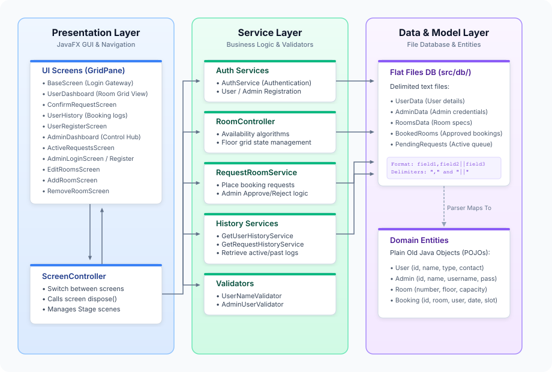

# Room Reservation System

The Room Reservation System is a desktop application built in Java and JavaFX designed to help with booking university rooms. It supports two main roles: regular users (students, staff, faculty) who want to reserve study or event rooms, and system administrators who manage requests and rooms.

---

## Setup Guide

### Prerequisites
Make sure you have **Apache Maven** and a **Java 21 JDK** installed on your system.

### Troubleshooting `JAVA_HOME` Configuration
If you experience compilation or execution failures when running Maven commands, ensure your `JAVA_HOME` environment variable is configured to point to JDK 21:

*   **Linux/macOS:**
    Add the following to your shell profile (e.g., `~/.bashrc` or `~/.zshrc`) or execute it in your terminal:
    ```bash
    export JAVA_HOME=/usr/lib/jvm/java-21-openjdk-amd64
    export PATH=$JAVA_HOME/bin:$PATH
    ```
    *(Adjust the path to match your local JDK 21 installation directory).*

*   **Windows:**
    1. Open **System Properties** and select **Environment Variables**.
    2. Under **System variables**, create or edit `JAVA_HOME` to point to your JDK 21 installation path (e.g., `C:\Program Files\Java\jdk-21`).
    3. Edit the `Path` variable and add `%JAVA_HOME%\bin` to the list.

### Command Line Execution
You can compile and run the application directly from your terminal at the project root using standard Maven commands:

```bash
# Clean project and compile source files
mvn clean compile

# Launch the JavaFX application
mvn javafx:run
```

### IDE Import (IntelliJ IDEA, Eclipse, VS Code)
Because the project uses standard Maven layout conventions, you do not need to check in any IDE-specific project files (like `.idea/` or `.iml` files):
1. Open your IDE and select **Open** or **Import**.
2. Point the IDE to the project root directory and select the [pom.xml](pom.xml) file.
3. The IDE will automatically read the project setup, download JavaFX libraries, and configure everything automatically.

---

## Technical Specifications & Requirements

The project uses the following tools:
* **Build Tool:** Apache Maven
* **Java Version:** JDK 21 (or higher)
* **UI Toolkit:** JavaFX 21

All required libraries and plugins are configured in the [pom.xml](pom.xml) file.

---

## Architectural Layout

The application follows a Model-View-Controller (MVC) structure to organize the code and manage screens:




### Data Layer
All data is saved in simple text files. The system reads and writes to these files using custom formatting and commas. The database directory contains:
* [AdminData](src/db/AdminData): Login details for admin accounts.
* [UserData](src/db/UserData): Login details, category (student/staff), and contact details for regular users.
* [RoomsData](src/db/RoomsData): Room details (room number, floor, capacity) for all registered rooms.
* [BookedRooms](src/db/BookedRooms): Approved room booking records.
* [PendingRequests](src/db/PendingRequests): User requests waiting for an admin to approve or reject them.

### Business Logic Layer (Services)
These services run the main features and handle the data:
* [RoomController](src/main/java/Services/RoomController.java): Checks if a room is free on a specific date, time, and floor.
* [AuthService](src/main/java/Services/AuthService.java): Checks login details.
* [RequestRoomService](src/main/java/Services/RequestRoomService.java): Creates and saves new room booking requests.
* [GetRequestHistoryService](src/main/java/Services/GetRequestHistoryService.java) & [GetUserHistoryService](src/main/java/Services/GetUserHistoryService.java): Get and show past bookings.
* [UserNameValidator](src/main/java/Services/UserNameValidator.java) & [AdminUserValidator](src/main/java/Services/AdminUserValidator.java): Check registration details and prevent duplicate accounts.

### Presentation Layer
All screens use a standard template to set up the screen layout and clean up resources when switching screens:
* [BaseScreen](src/main/java/view/BaseScreen.java): User login screen.
* [UserDashboard](src/main/java/view/UserDashboard.java): Allows users to search for rooms by date, time, and floor. Free rooms are shown as colored boxes on a grid.
* [ConfirmRequestScreen](src/main/java/view/ConfirmRequestScreen.java): Booking confirmation step showing user details.
* [AdminDashboard](src/main/java/view/AdminDashboard.java): Main screen for admins.
* [ActiveRequestsScreen](src/main/java/view/ActiveRequestsScreen.java): List of requests waiting for approval with buttons to Approve or Reject.
* [EditRoomsScreen](src/main/java/view/EditRoomsScreen.java): Screen to manage rooms (Add, Edit Capacity, Remove).
